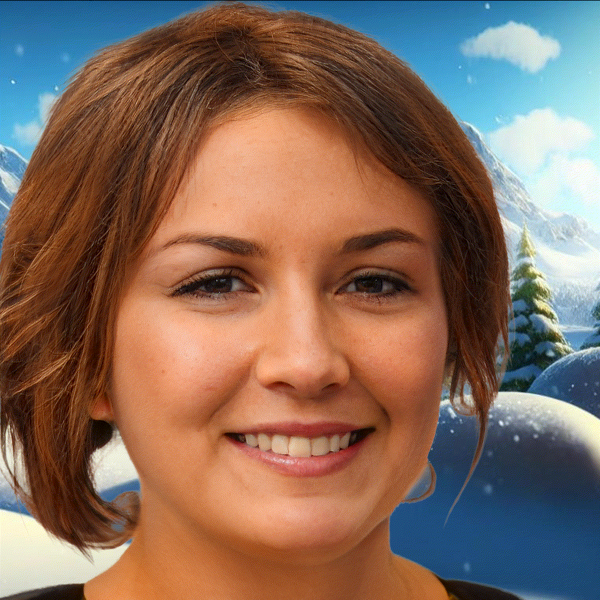

# StyleMatte: Adversarially-Guided Portrait Matting

[Sergei Chicherin](https://github.com/chroneus), [Karen Efremyan](https://github.com/befozg)

[[`arXiv`](https://arxiv.org/abs/2305.02981)] [[`BibTeX`](#CitingStyleMatte)] [[`Gitlab`](https://gitlab.aicloud.sbercloud.ru/rndcv/stylematte)]


<p align="left">
  
</p><br/>

## Model Zoo and Baselines


| State file                           | Size     | Where to place                                   | Download |
|-----------------------------------|----------|-------------------------------------------|----|
| stylematte_pure.pth    | 133.6 MB  |  `stylematte/checkpoints/`        | [stylematte.zip](https://sc.link/lYkM5) |
| stylematte_synth.pth | 133.6 MB  |   `stylematte/checkpoints/` | [stylematte.zip](https://sc.link/lYkM5) |
| animals.pkl    | 300.5 MB  |    `stylegan3`      | [stylemattegan.zip](https://sc.link/kRjO5) |
| humans.pkl    | 281.1 MB  |    `stylegan3`      | [stylemattegan.zip](https://sc.link/kRjO5) |


## How to run StyleMatteGAN
To synthesize synthetic dataset of RGBA images, move to `stylegan3` and run `synthesize.py`. You should create conda environment from `stylegan3/environment.yml`. You can also generate images with different truncation and seed values using `gen_images.py` .

```bash
conda activate stylegan3
cd stylegan3
python synthesize.py
```

To change image background on synthetic dataset, run 
```bash
python visualizer.py
```

In the GUI you can choose model weights, background picture, truncation value and other visualization parameters. 

## StyleMatteGAN results

<p align="left">
  
</p><br/>

## How to run StyleMatte
To test our model, change directory to `stylematte` and run `test.py`. You can modify `test.yaml` file for your datasets and models.

```bash
cd stylematte
python test.py
```

The report directory is `stylematte/report/`. See report examples there.

## StyleMatte results

<p align="left">
  
</p><br/>

## <a name="CitingStyleMatte"></a>Citing StyleMatte

If you use StyleMatte in your research or refer to the results published in the paper, please use the following BibTeX entry.

```BibTeX
@inproceedings{stylematte,
    title={Adversarially-Guided Portrait Matting}, 
    author={Sergej Chicherin and Karen Efremyan},
    journal={arXiv preprint arXiv:2305.02981},
    year={2023}
}
```